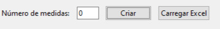
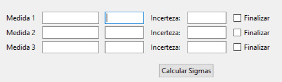

# Calculadora-para-Fisica-Experimental

## Finalidade do Projeto

Este projeto foi feito para facilitar e tornar muito mais rápido os cálculos mais comuns em Física Experimental, além de gerar o gráfico com a equação gerada pelo grupo de medidas tanto com regressão linear quanto quadrática.
Além disso, para facilitar armazenar os dados obtidos, implementei uma conexão com o Excel, ele cria um arquivo e insere as informações principais nele, compatível com Excel ou qualquer programa que roda arquivos .xlsx, ademais, ele também pode ler um arquivo .xlsx e preencher automaticamente as informações.

## Linguagem Utilizada

Para este programa foi utilizado Python, muito devido a sua facilidade para criação de janelas, botões interativos e geração de gráficos, além disso, a quantidade de bibliotecas poderosas tornou bem mais trivial algumas funcionalidades mais complexas.

## Como usar

O programa é bem simples no quesito de possibilidades, há duas janelas com funcionalidades totalmente distintas.
A primeira chama-se "Sigma Direto" e nela é possível obter:
    
    O Desvio Padrão (σ);
    A Incerteza Estatística (σₐ);
    A Incerteza Instrumental (σ_B);
    A Incerteza Total (σ_T).

    

É possível adicionar várias medidas de uma vez, números grandes de medidas podem afetar o tempo de execução, basta escrever a quantidade de medidas desejada e clicar em Criar para aparecer um novo campo para preencher com as informações. Além disso, ao lado há o botão "Carregar Excel", o qual possibilita carregar um arquivo excel para leitura e preenchimento automático dos campos, o que será explicado de maneira mais detalhada posteriormente.
Após criar o campo, ele aparecerá abaixo e será assim:

    

Logo ao lado de Medida X, há um campo no qual é possível nomeá-las, caso não sejam preenchidas, as medidas permanecem com o nome genérico "Medida X", logo ao lado desse campo há outro em que deve ser inserida as medidas, é bom mencionar que esses campos são dinâmicos, ou seja, a medida que você adiciona uma medida e aperta 'Enter', novos campos vão surgindo, não há um limite definido, porém uma quantidade grande de medidas tende a levar a falha (mais de 1000 medidas), estas medidas devem ser escritas com ponto invés de vírgula. Por último, há o campo de incerteza, no qual deve ser informado a Incerteza Instrumental - caso não haja, deve ser escrito 0 para o programa funcionar. Há também o check 'Finalizar', que tranca a linha de medidas e exclue todas as janelas vazias.
